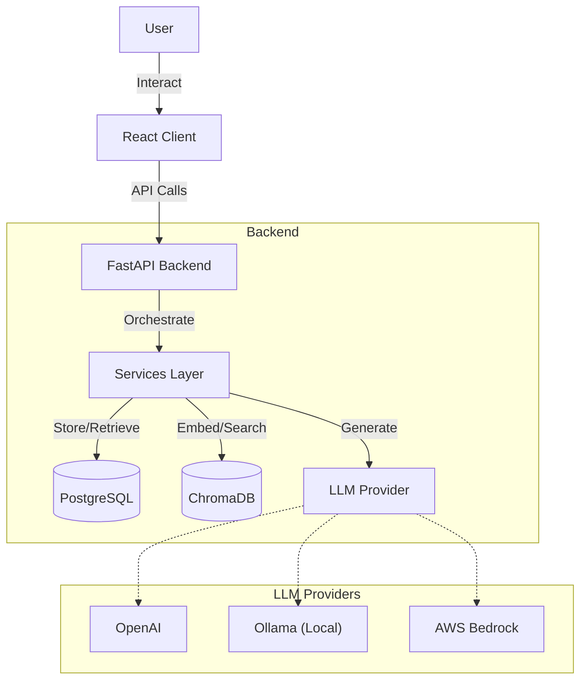
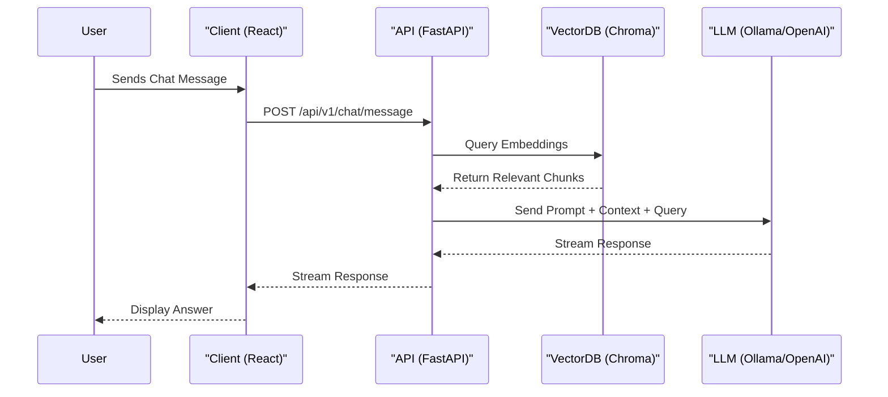
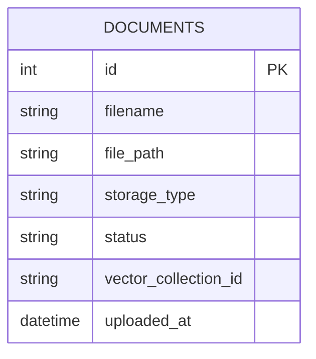

# AIDEMO

## 1. Executive Summary
**AIDEMO** is a full-stack **Retrieval-Augmented Generation (RAG)** application. It allows users to upload documents (PDFs, etc.), which are processed and indexed into a vector database. Users can then chat with these documents using Large Language Models (LLMs).

The system supports:
- **Multi-modal Document Ingestion**: PDF, DOCX, etc.
- **Vector Search**: Using ChromaDB.
- **LLM Integration**: OpenAI, Ollama (local), AWS Bedrock, Azure.
- **Modern UI**: React-based dashboard for document management and chat.

---

## 2. Architecture



---

## 3. Backend Deep Dive (`/backend`)

### Tech Stack
- **Framework**: FastAPI
- **Database**: SQLAlchemy (AsyncPG for Postgres), AIOSQLite
- **AI/ML**: LangChain, ChromaDB, Sentence Transformers, Unstructured
- **Package Manager**: Pip / UV (implied by uv.lock)

### Key Components

#### API Layer (`app/api/v1/endpoints`)
- **`documents.py`**: Upload, list, and delete documents.
- **`chat.py`**: Chat interface endpoints.
- **`llm.py`**: Manage LLM configurations.
- **`rag.py`**: Core RAG operations (retrieval + generation).

#### Core Services (`app/services`)
| Service | Purpose |
| :--- | :--- |
| `document_service.py` | Handles file uploads, storage, and database records. |
| `vector_service.py` | Manages ChromaDB collections and embeddings. |
| `rag_service.py` | Orchestrates the retrieval and generation loop. |
| `llm_service.py` | Interfaces with OpenAI, Ollama, etc. |
| `document_processor.py` | Extracts text from PDF/DOCX files. |

#### Data Models (`app/models`)
**`Document` Model**:
- `id`: Primary Key
- `filename`: Original file name
- `storage_type`: Local / S3 / Azure
- `status`: Processing stage (Uploading -> Parsing -> Indexing -> Completed)
- `vector_collection_id`: Link to ChromaDB collection

---

## 4. Client Deep Dive (`/Client`)

### Tech Stack
- **Framework**: React 19
- **Build Tool**: Create React App (react-scripts)
- **Styling**: Bootstrap 5, SCSS
- **Routing**: React Router DOM v7
- **Visualization**: ApexCharts, React-ApexCharts

### Key Pages (`src/pages`)
- **Login/Register**: Authentication pages.
- **`DocumentList.tsx`** (`/documents`): Dashboard to upload and view processed documents.
- **`ChatPage.tsx`** (`/chat`): Chat interface to interact with uploaded documents.

### Routing (`src/config/app-route.tsx`)
The app uses a central routing configuration:
- Public routes: `/login`, `/register`, `/forgotpassword`
- Protected routes (wrapped in `App` layout):
    - `/documents`
    - `/chat`

---

## 5. Data Flow Example: Document Upload & Chat

### Sequence Diagram: RAG Chat Flow


1.  **Upload**: User uploads a PDF via `DocumentList` page.
2.  **Ingest**: Backend `document_service` saves the file and creates a DB record with status `UPLOADING`.
3.  **Process**:
    -   `document_processor` extracts text.
    -   `vector_service` chunks text and generates embeddings.
    -   Embeddings are stored in **ChromaDB**.
    -   Status updates to `COMPLETED`.
4.  **Chat**:
    -   User sends a query on `ChatPage`.
    -   `rag_service` converts query to vector.
    -   Searches ChromaDB for relevant chunks.
    -   Sends chunks + query to LLM (e.g., Ollama).
    -   Returns answer to Client.

---

## 6. Database Schema (ERD)



---

## 7. Setup & Installation

Follow these steps to set up the project locally.

### Prerequisites
- **Node.js** (v18+ recommended)
- **Python** (v3.12+)
- **PostgreSQL** (running locally or accessible)

### 1. Backend Setup

1.  **Navigate to the backend directory**:
    ```bash
    cd backend
    ```

2.  **Create and activate a virtual environment**:
    ```bash
    # Windows
    python -m venv .venv
    .venv\Scripts\activate

    # macOS/Linux
    python3 -m venv .venv
    source .venv/bin/activate
    ```

3.  **Install dependencies**:
    ```bash
    pip install -r requirements.txt
    # OR if using uv
    uv sync
    ```

4.  **Environment Configuration**:
    - Copy the example environment file:
      ```bash
      cp .env.development .env
      ```
    - Update `.env` with your database credentials and API keys (OpenAI, etc.).

5.  **Database Setup**:
    - Ensure PostgreSQL is running and create a database (e.g., `aidemo_dev`).
    - Run migrations:
      ```bash
      alembic upgrade head
      ```
    - (Optional) Run setup script for initial data:
      ```bash
      python setup.py
      ```

6.  **Run the Backend**:
    ```bash
    python start.py
    # OR
    uvicorn app.main:app --reload
    ```
    The API will be available at `http://localhost:8000`.

### 2. Client Setup

1.  **Navigate to the Client directory**:
    ```bash
    cd ../Client
    ```

2.  **Install dependencies**:
    ```bash
    npm install --legacy-peer-deps
    ```
    *Note: `--legacy-peer-deps` may be required due to some dependency conflicts.*

3.  **Run the Client**:
    ```bash
    npm start
    ```
    The application will run at `http://localhost:3000`.

### 3. Verification
- Open your browser to `http://localhost:3000`.
- Log in or register a new account.
- Try uploading a document and chatting with it to ensure the full stack is connected.